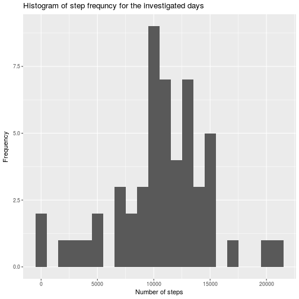
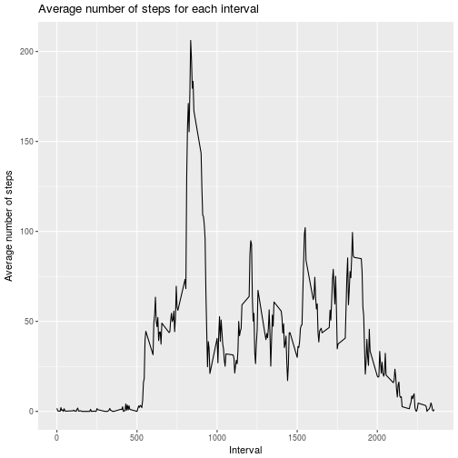
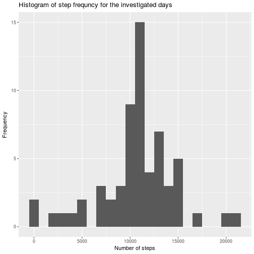
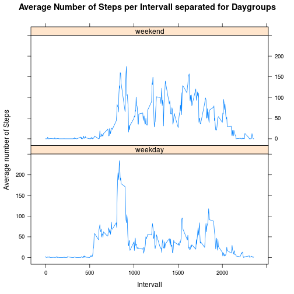

```r
title: "Coursera Assignment Reproducible Research Week 2"
```

```
## Warning: NAs durch Umwandlung erzeugt
```

```
## Error in title:"Coursera Assignment Reproducible Research Week 2": NA/NaN Argument
```

```r
author: "Sebastian Fischer"
```

```
## Error in eval(expr, envir, enclos): Objekt 'author' nicht gefunden
```

```r
date: "8 März 2018"
```

```
## Warning: NAs durch Umwandlung erzeugt
```

```
## Error in date:"8 März 2018": NA/NaN Argument
```

```r
output: html_document 
```

```
## Error in eval(expr, envir, enclos): Objekt 'output' nicht gefunden
```

```r
keep_md: yes
```

```
## Error in eval(expr, envir, enclos): Objekt 'keep_md' nicht gefunden
```


## Task

The task is to learn to write a reproducible file. In the file should be an analysis of taken steps in specific time 
intervals.

## Import the Data

First import the data and store it:


```r
input <- read.csv("activity.csv")
```

## Question 1

At first, the mean total number of steps taken per day should be calculated. The data is stored as "stepsPerDay"


```r
stepsPerDay <- aggregate(input$steps, by= list(Date = input$date), sum)
stepsPerDay <- rename(stepsPerDay, c("Date"="Date", "x" = "Steps"))
```

Next, a histogram should be created to visualize the data.


```r
ggplot(stepsPerDay, aes(x=Steps))+
        geom_histogram(binwidth = 1000) +
        labs(title="Histogram of step frequncy for the investigated days", x= "Number of steps", y= "Frequency")
```

```
## Warning: Removed 8 rows containing non-finite values (stat_bin).
```



Finally the mean and medium of the total number of  steps should be calculated:


```r
median(stepsPerDay$Steps, na.rm = TRUE)
```

```
## [1] 10765
```

```r
mean(stepsPerDay$Steps, na.rm = TRUE)
```

```
## [1] 10766.19
```

The mean and median values are nearly identical.

## Question 2

What is the average daily activity pattern?

First a time series plot of the 5-minute interval (x-axis) and the average number of steps taken, averaged across all 
days (y-axis) should be created.


```r
stepsPerInterval <- aggregate(input$steps, by= list(Interval= input$interval),mean, na.rm=TRUE)
stepsPerInterval <- rename(stepsPerInterval, c("Interval"="Interval", "x" = "Steps"))


ggplot(stepsPerInterval, aes(x=Interval,y=Steps))+
        geom_line()+
        labs(title="Average number of steps for each interval", y="Average number of steps")
```



Which 5-minute interval, on average across all the days in the dataset, contains the maximum number of steps?


```r
stepsPerInterval[which.max(stepsPerInterval$Steps), ]
```

```
##     Interval    Steps
## 104      835 206.1698
```

The winner is interval 835

## Question/Task 3

Imputing missing values

Calculate and report the total number of missing values in the dataset (i.e. the total number of rows with NAs)


```r
sum(is.na(input))
```

```
## [1] 2304
```
 There are 2304 rows with missing values.
 
 Devise a strategy for filling in all of the missing values in the dataset. The strategy does not need to be sophisticated. 
 For this task the NAs should be replaced by the average number of steps in the respective interval. Create a new dataset
 that is equal to the original dataset but with the missing data filled in. This is called "final". It is also checked if
 all NAs are removed


```r
impute.mean <- function(x) replace(x, is.na(x), mean(x, na.rm = TRUE))

input2 <- ddply(input, ~ interval, transform, steps= impute.mean(steps))
final <- input2[order(input2$date,input2$interval), ]

sum(is.na(final))
```

```
## [1] 0
```

Make a histogram of the total number of steps taken each day and Calculate and report the mean and median total number 
of steps taken per day. Do these values differ from the estimates from the first part of the assignment? What is the 
impact of imputing missing data on the estimates of the total daily number of steps?


```r
stepsPerDayNew <- aggregate(final$steps, by= list(Date = final$date), sum)
stepsPerDayNew <- rename(stepsPerDayNew, c("Date"="Date", "x" = "Steps"))
ggplot(stepsPerDayNew, aes(x=Steps))+
        geom_histogram(binwidth = 1000) +
        labs(title="Histogram of step frequncy for the investigated days", x= "Number of steps", y= "Frequency")
```



```r
median(stepsPerDayNew$Steps, na.rm = TRUE)
```

```
## [1] 10766.19
```

```r
mean(stepsPerDayNew$Steps, na.rm = TRUE)
```

```
## [1] 10766.19
```

The only impact ist, that mean and median values are now the same. This result would differ is another substitution
would be used.


## Question 4

Are there differences in activity patterns between weekdays and weekends?

A new factor variable called "Categorie" is introduced


```r
input$weekday <- weekdays(as.Date(input$date))

input[input$weekday %in% c("Montag", "Dienstag","Mittwoch","Donnerstag","Freitag"), "Categorie"] <- "weekday"
input[input$weekday %in% c("Samstag","Sonntag"), "Categorie"] <- "weekend"
```

Finally, a panel plot is created for the comparison of weekdays and weekend.


```r
stepsPerIntervalPerDaygroup <- aggregate(steps~interval+Categorie, data=input, mean)


xyplot(steps~interval | Categorie, data= stepsPerIntervalPerDaygroup, type="l", layout=c(1,2), 
       ylab="Average number of Steps", xlab= "Intervall", 
       main="Average Number of Steps per Intervall separated for Daygroups")
```


```

